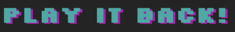

  

_______________

# WS24-play-it-back
A video game archival knowledge base to preserve the indie retro video games you love!

[Short Summary of the Project](#summary)  |  [Requirements](#Requirements)  |  [First Steps and Frontend](#firststepsFE)  |   [Backend Setup](#backendsetup)  |  [Backend: Testing the Endpoints](#BEendpoints)  |  [Deployment](#deployment)  |  [Authors](#authors)  

## Short Summary of the Project

*Play It Back!* is a videogame preservation network where users can contribute information, resources, copies, and contacts related to rare or scarcely documented classic video games and systems. Powered by Moby Games’ dataset, *Play It Back!* aims to take videogame Wikis a step forward and contribute to preserving the historical memories of videogames played, cherished and remembered by so many gamers worldwide.

## Requirements (General)

To run this project, you will need:

- node.js
- react + vite
- MongoDB
- Mongoose
- fly.io
- Postman (optional, to test endpoints)

You should be able to install most dependencies by running `npm install` in the front-end and in the back-end folder, as covered in the steps that follow. [Fly.io](http://Fly.io) works slightly differently, but this is handled in the corresponding section below.

## First Steps & Frontend

- clone our project to your computer

`$ clone https://github.com/TechLabs-Remote-Bootcamp/WS24-play-it-back.git`

- in your code editor, open the folder named WS24-PLAY-IT-BACK
- via your terminal, navigate to the front-end folder

`$ cd front-end/`

- install the dependencies

`$ npm install`

- run it

`$ npm run dev`To be able to connect to BE/DS data, dependencies need to be installed

## Backend Setup

1. Navigate to backend folder

`$ cd back-end/`

1. Install dependencies

`$ npm install`

This should install all dependencies required for the back-end.

1. Setting up environment variables: You should see a file named .env.example in the back-end folder. 
    - Rename it to .env
    - Open the file and replace it with your own secrets and credentials. You need:
        - MONGO_URI (your MongoDB connection string, following a template like mongodb+srv://<user>:<password>@cluster0.mongodb.net/<dbname> )
        - JWT_SECRET (can be a random string, e.g. JWT_SECRET=doYouLikeKirby? )
        - you can leave the FRONTEND_ORIGIN as is.
2. Run the backend

`$ npm start`

The server should start on port 3000. Your console should log `Connected to MongoDB` if everything worked, and you’re ready to test the endpoints!

## Backend: Testing the Endpoints

We used Postman to test the endpoints, but you’re free to use that or any similar tool… it’s your life, after all!
Be that as it may, here are the endpoints you can test locally.

- `POST` : [`localhost:3000/auth/register`](http://localhost:3000/auth/register) (user registration)
- `POST` : [`localhost:3000/auth/login`](http://localhost:3000/auth/register)(user login)

Both POST requests take a raw JSON body, like this one:

`{
"username": "someRandomIdiot",
"password": "passwordsArePasse_UwU_123!"
}`

The Games endpoint can be tested using [fly.io](http://fly.io) (see blow)

## Deployment

Description where frontend and backend are deployed, URLS, and step-by-step instructions how to do it

### Frontend

Our deployed frontend lives [here](https://play-it-back.pages.dev/).

1. Navigate to your project directory and run the command `npm run build` to create a production-ready build of your frontend application. This will generate a dist folder.
2. Create a Cloudflare account (if you don’t have one) at [Cloudflare.com](http://cloudflare.com/)
3. Once you are in the dashboard, click the ‘Add’ blue button at the top of the page and choose ‘Pages’
4. Choose ‘Create using direct upload’ and click ‘Upload assets’
5. Give your project a name, then upload the dist folder 
6. Click the ‘Deploy Site’ button to begin the deployment process.

### Backend (with Fly.io)

The deployed backend lives [here](https://play-it-back.fly.dev/).

If you want to see the deployed mongoDB database, run https://play-it-back.fly.dev/games/ in your browser. You can also test a number of other endpoints over there, e.g.

- genres: https://play-it-back.fly.dev/games/genres
- platforms: https://play-it-back.fly.dev/games/platforms
- recently added games: https://play-it-back.fly.dev/games/recent
- tags (subgenres): https://play-it-back.fly.dev/games/tags

More info on [fly.io](http://fly.io) deployment in the blog post. There, you'll find instructions for deployment similar to the ones outlined for the frontend above.

## Authors
This project was created by:

* Web Developer (FE): Andreea Cioca
* Web Developer (FE): Lucia Rosivalova
* Web Developer (BE): Giorgio Chiappa
* Web Developer (BE): Maya Kotsifaki Sarpaki
* Data Science: Maya Kotsifaki Sarpaki
* Data Science: Izzet Fatih Çetinkaya
* Mentor: Timm Stelzer
